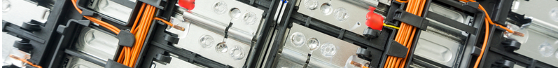

# Almacenamiento Sectores Productivos

 
:fontawesome-solid-industry: :fontawesome-solid-car-battery:

 

{ width=100%}

=== ":fontawesome-solid-euro-sign: Ayudas"

    Incorporación almacenamiento autoconsumo en instalaciones existentes:  200 - 700 €/kWh (45 – 65 % ayuda sobre coste subvencionable)

=== ":fontawesome-solid-file-pdf: Estudio"

    <iframe allowfullscreen="true" src="https://formulario-yzohicfcma-ew.a.run.app/contacto" width="100%" height="75%" style="border: 1px solid #fff; max-width: 1200px; min-height: 2500px" > </iframe>

