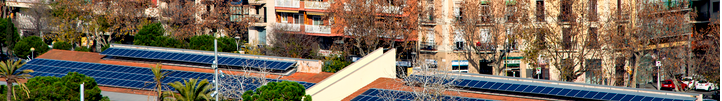

# Autoconsumo Residencial

 
:fontawesome-solid-home: :fontawesome-solid-solar-panel: :fontawesome-solid-fan:
 

{ width=100%}
=== ":fontawesome-solid-euro-sign: Ayudas"
    

    === "**Residencial**"

        - Instalación Fotovoltaica autoconsumo: 300 - 600 €/kWp
        - Instalación eólica autoconsumo: 650 – 2.900 €/Kw
        - Incorporación almacenamiento autoconsumo: 140 - 490 €/kWh

    === "**AA públicas**"

        - Instalación Fotovoltaica autoconsumo: 500 – 1.000 €/kWp
        - Instalación eólica autoconsumo: 1.150 – 4.100 €/kW 
        - Incorporación almacenamiento autoconsumo: 140 - 490 €/kWh 

=== ":fontawesome-solid-file-pdf: Estudio"

    <iframe allowfullscreen="true" src="https://formulario-yzohicfcma-ew.a.run.app/contacto" width="100%" height="75%" style="border: 1px solid #fff; max-width: 1200px; min-height: 2500px" > </iframe>

​La potencia máxima a incentivar en las instalaciones de autoconsumo eólicas o fotovoltaicas de los Programas 1, 2 y 4 será hasta 5.000 kW.